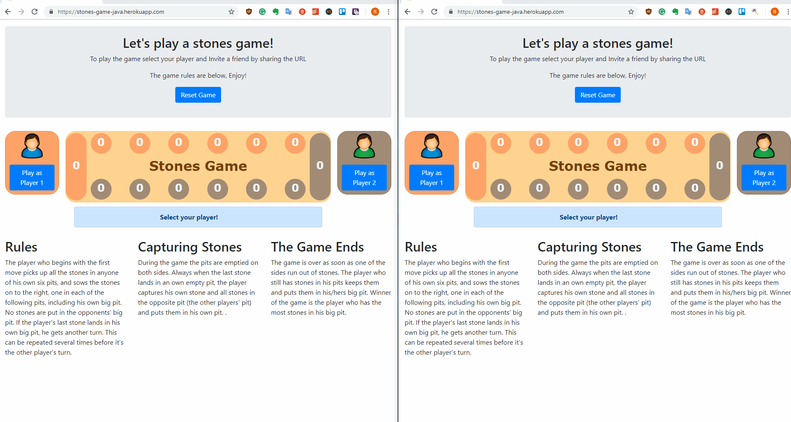

# StonesGame  

Stones Game in Java using Spring boot 

## Board Setup
Each of the two players has his six pits in front of him. To the right of the six pits, each player has a larger pit. In each of the six round pits are put six stones when the game starts.

## Rules - Game Play

The player who begins with the first move picks up all the stones in anyone of his own six pits, and sows the stones on to the right, one in each of the following pits, including his own big pit. No stones are put in the opponents' big pit. If the player's last stone lands in his own big pit, he gets another turn. This can be repeated several times before it's the other player's turn.

## The Game ends.

The game is over as soon as one of the sides run out of stones. The player who still has stones in his pits keeps them and puts them in his/hers big pit. Winner of the game is the player who has the most stones in his big pit.

## Demo

##  Prerequisites :
Java 8
Maven 3.+

## Installation - How to run the project.

 - Dowload the zip file and extract the content to your computer or
   clone it with git. 
   
 - Navigate to the root level of the project    where the `pom.xml` file
   is.
 - Run the following commands:
	 - `mvn clean` or `mvn clean verify` to run the tests.
	 - `mvn package install` should start the application in your local enviroment
	go to http://localhost:8080/ and you should be able to see the board.

	or 
	
	Import the project as existing maven project in your Java IDE and run it from there.
 
 ## Docker Support:
 
 If you have docker installed at the root level of the project run the following command :

     mvn package docker:build -DskipTests
It should create a docker image, to verify this run :

    docker image ls
you should see an image named `rayweb/stonesgame`

Fire a container with the following command

    docker run -it -p 8080:8080 rayweb/stonesgame
You should be able to see the board at http://localhost:8080/

## Documentation (Swagger)
Autogenerated documentation can be found in Http://localhost:8080/swagger-ui.html once you have the project running.

